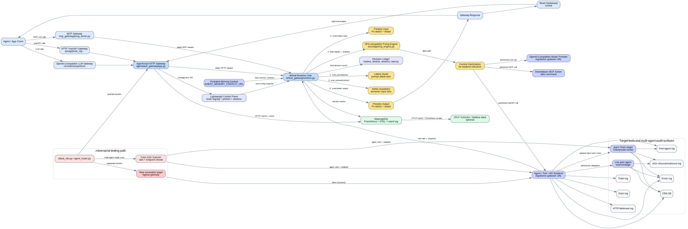

# Murdoc

Murdoc is an AI security gateway for agents, tools, and MCP traffic. It gives
security and platform teams one self-hosted control point to inspect requests,
authorize tool calls, redact sensitive data, enforce policy, and audit agent
workflows without rewriting the agent stack.



Murdoc runs as a gateway in front of model calls, tool calls, and MCP sessions.
The shared runtime applies prompt-injection checks, sensitive-data redaction,
policy decisions, semantic guardrails, and audit summaries before agent traffic
continues.

The console includes route/profile management, attack-lab runs, observability
links, RBAC-aware sign-in, and enterprise readiness checks for production
operators.

## Setup

Install the gateway:

```bash
pip install .
```

Install local development dependencies:

```bash
pip install -r requirements.txt
cd ui
npm install
cd ..
```

Start the local development stack:

```bash
./start.sh
```

The script starts the FastAPI gateway and Vite console. Attack Lab target agents
are started on demand by each configured attack run, using the selected target
fixture and temporary ports, then torn down after the run. The script loads
`.env` when present, writes service logs under `logs/`, checks ports before
starting, waits for health checks, and stops child processes on `Ctrl+C`.

```text
Gateway API:  http://localhost:8000
Console:      http://localhost:5173
```

Run only selected local services:

```bash
./start.sh --no-ui
./start.sh --agent
./start.sh --observability
```

Run the gateway API directly:

```bash
uvicorn murdoc.gateway.app:app --host 0.0.0.0 --port 8000
```

Run the console directly:

```bash
cd ui
npm run dev
```

Open `http://localhost:5173`.

Detailed integration, control-plane, MCP, observability, and testing notes live
in [docs/guide.md](docs/guide.md).

## Contributing

See [CONTRIBUTING.md](CONTRIBUTING.md) for the repo boundaries and local checks.
